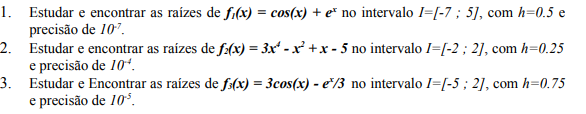
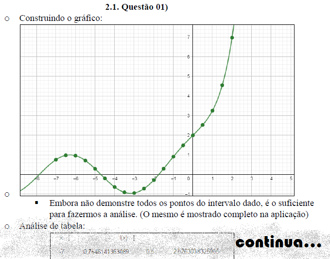
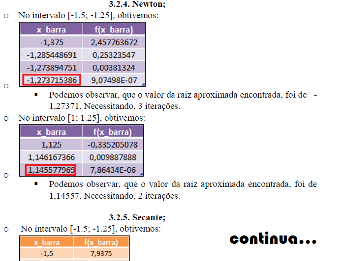
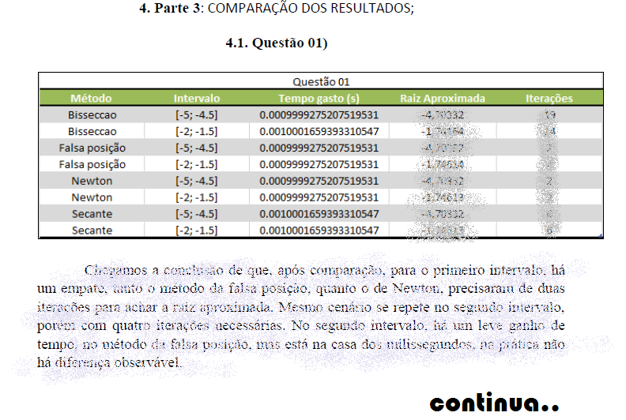

# Primeiro_trabalho_calculo_numerico
 Trabalho referente à primeira unidade da disciplina de cálculo numérico. UFERSA, 2021.

 <h1>Questões de estudo: </h1>
</img>
<h1>Metodologia:</h1>
<h2>    Parte 1:</h2>

Consiste em isolar as raízes e provar que são únicas em determinado intervalo

Preview: 

</img>
<h2>    Parte 2:</h2>

Consiste em aplicar os seguintes métodos de refinamento a todos os intervalos:

-Bissecção

-Falsa posição

-Ponto fixo

-Newton

-Secante

Preview: 

</img>
<h2>    Parte 3:</h2>

Consiste em comparar as raízes encontradas, e fazer uma comparação entre os métodos:
</img>

</img> Link do vídeo explicativo: https://www.youtube.com/watch?v=lHS9F6CrPPE

